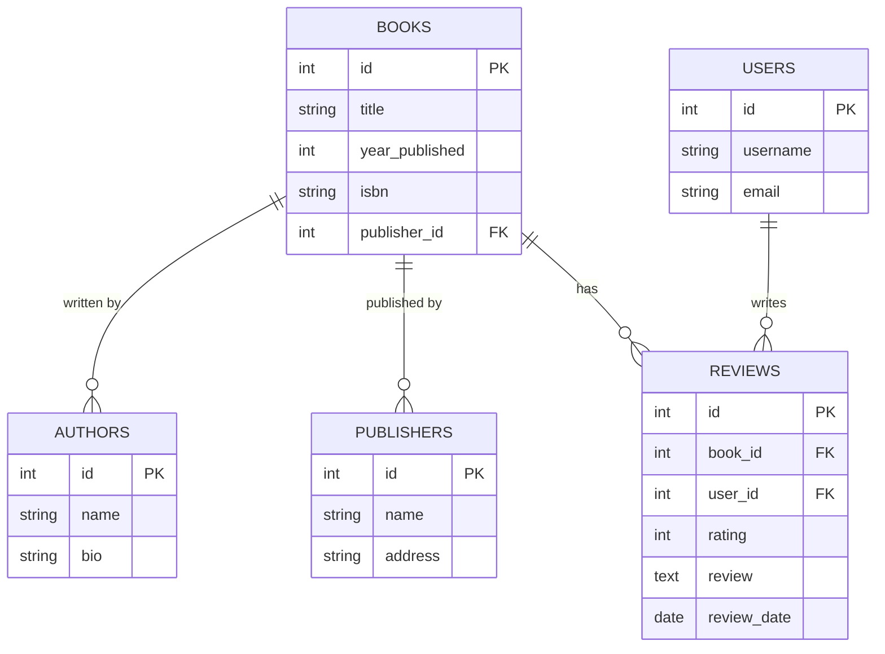

# Book Database Design

## Project Goal
Create a database to manage books, authors, publishers, and user interactions. The database will allow:
- Tracking book details and metadata
- Managing author and publisher information
- Recording user interactions (ratings, reviews)
- Generating reports and statistics

## Entity Relationship Diagram

## Scope
- Database will support CRUD operations for all entities
- Support for complex queries like:
  - Books by specific author
  - Average rating per book
  - Most reviewed books
  - Books published in specific year range
- Data validation and constraints
- Indexes for common search fields

## Optimizations
- Indexes on frequently searched fields (title, author name, ISBN)
- Views for common reports
- Normalized schema to reduce redundancy
- Constraints to maintain data integrity

## Constraints
- ISBN must be unique
- Rating must be between 1-5
- Review dates cannot be in the future
- Email addresses must be valid format
